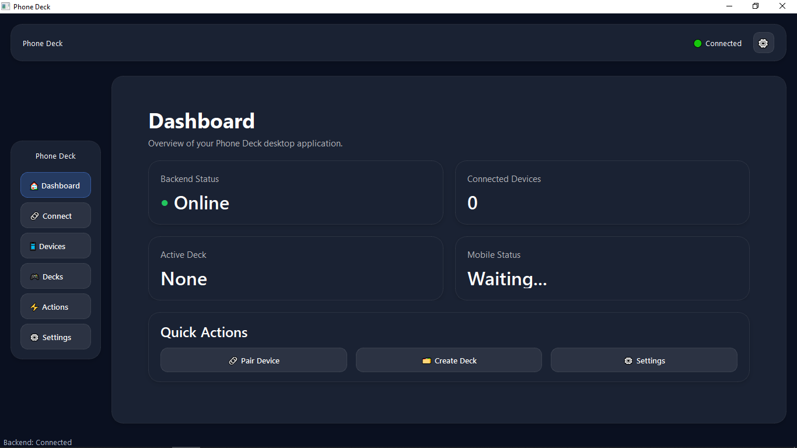
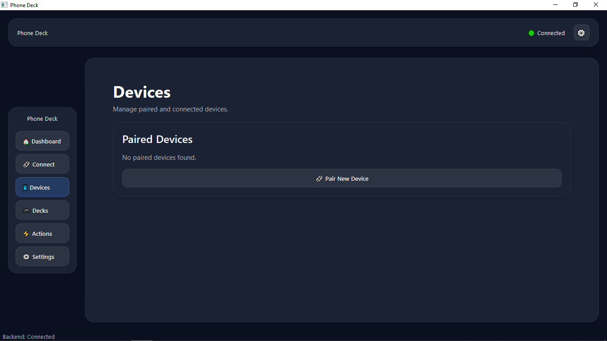
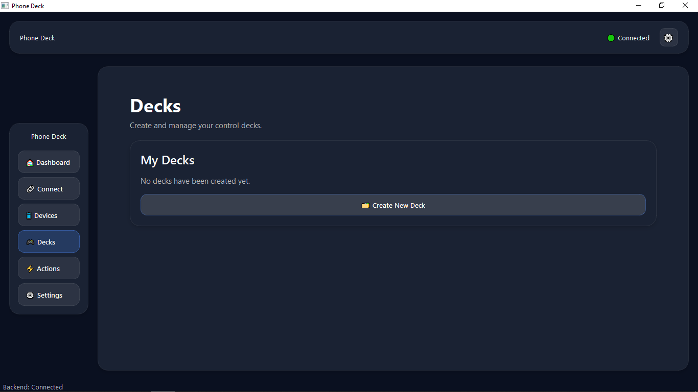
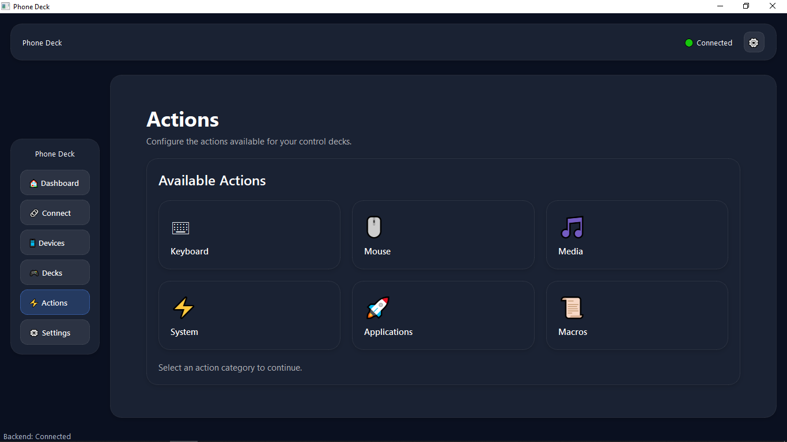
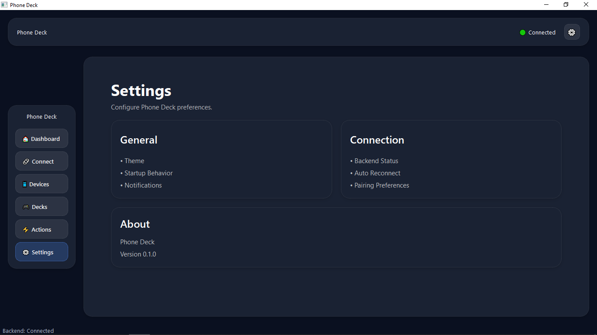

<div align="center">

# 📱 Phone Deck

### Turn Your Smartphone into a Powerful Desktop Control Deck

*A modern, open-source alternative to the Elgato Stream Deck that transforms your Android phone into a customizable control surface for your Windows PC.*


</div>

---

# 📖 Overview

Phone Deck is an open-source ecosystem that transforms your Android phone into a powerful desktop control deck inspired by the **Elgato Stream Deck**.

Instead of requiring dedicated hardware, Phone Deck allows any Android device to securely connect to a Windows PC and execute customizable actions through a modern desktop management interface and a high-performance FastAPI backend.

The project follows a **modular**, **plugin-based**, and **event-driven** architecture, making it easy to extend with new actions, plugins, integrations, and automation workflows.

---

# 🏗 Project Components

Phone Deck consists of three major applications.

## 🖥 Desktop Application (PySide6)

Provides a modern desktop interface used to:

- Manage devices
- Manage decks
- Configure buttons
- Browse available actions
- Edit settings
- Monitor backend connectivity

---

## ⚡ Laptop Host (FastAPI)

Acts as the communication server responsible for:

- REST API
- WebSocket communication
- Secure pairing
- Authentication
- Runtime action execution
- Plugin management
- Device communication

---

## 📱 Android Application *(Coming Next)*

The Android application will become the actual control surface.

Users will be able to:

- Pair using OTP
- Display dynamic decks
- Execute desktop actions
- Receive real-time updates
- Control Windows remotely

---

# 📌 Current Development Status

| Phase | Status |
|--------|--------|
| ✅ Phase 1 | Backend Foundation |
| ✅ Phase 2 | Desktop UI Foundation |
| ✅ Phase 3 | Communication & Authentication Foundation |
| 🚧 Phase 4 | Android Application Development |
| 📅 Future | Runtime Synchronization |
| 📅 Future | Dynamic Deck Editor |
| 📅 Future | Plugin Marketplace |

---

# ✨ Features

## ✅ Completed

### Backend

- FastAPI REST API
- Secure OTP-based pairing
- WebSocket communication
- JSON communication protocol
- Protocol validation
- Client session management
- Connection management
- Authentication over WebSocket
- Generic action execution
- Action Registry
- Plugin architecture
- Runtime state management
- Event broadcasting
- Asynchronous architecture
- Backend health monitoring

---

### Desktop Application

- Modern PySide6 desktop interface
- Dashboard
- Device page
- Deck page
- Actions page
- Settings page
- Sidebar navigation
- Backend status indicator
- Reusable UI components
- Dark theme
- Responsive layouts

---

### Communication Layer

- REST communication
- WebSocket endpoint
- Connection manager
- Ping / Pong heartbeat
- Message routing
- Protocol validation
- OTP authentication
- Runtime events
- Generic action dispatcher

---

# 🚧 Currently In Development

The next milestone focuses on building the Android application.

Planned features include:

- Android application (Jetpack Compose)
- Android ↔ Laptop communication
- Runtime synchronization
- Dynamic button rendering
- Profile synchronization
- Live deck updates
- Mobile action execution

---

# 📅 Planned Features

- Dynamic deck editor
- Multi-page decks
- Drag-and-drop button editor
- OBS Studio integration
- Spotify integration
- Discord integration
- Visual Studio integration
- Plugin marketplace
- AI-assisted automation
- Cloud synchronization
- Cross-platform support

---

# 🏗 High-Level Architecture

```text
                  Android Application
                     (Controller)
                           │
                   REST / WebSocket
                           │
             ┌─────────────┴─────────────┐
             │                           │
             ▼                           ▼
     Desktop Application          Laptop Host
         (PySide6)                 (FastAPI)
             │
             ▼
      Action Registry
             │
             ▼
        Plugin System
             │
             ▼
      Windows Automation
             │
             ▼
      Windows Operating System
```

---

# 🛠 Tech Stack

| Category | Technologies |
|-----------|--------------|
| Desktop | Python, PySide6 (Qt) |
| Backend | Python, FastAPI |
| Communication | REST API, WebSockets |
| Runtime | AsyncIO |
| UI | Qt Widgets |
| Architecture | Modular, Event-driven, Plugin-based |
| Platform | Windows |

---

# 📂 Repository Structure

```text
Phone-Deck/
│
├── desktop-app/
│   ├── assets/
│   ├── ui/
│   ├── services/
│   ├── state/
│   └── app.py
│
├── laptop-host/
│   ├── app/
│   ├── plugins/
│   ├── requirements/
│   └── requirements.txt
│
├── docs/
│
├── ARCHITECTURE.md
├── LICENSE
└── README.md
```

---

# 🚀 Getting Started

## 1. Clone the Repository

```bash
git clone https://github.com/PranavChamoli06/Phone-Deck.git

cd Phone-Deck
```

---

## 2. Start the Laptop Host

```bash
cd laptop-host

python -m venv .venv

.venv\Scripts\activate

pip install -r requirements.txt

python -m uvicorn app.main:app --host 0.0.0.0 --port 8000
```

Available endpoints

- Swagger UI → http://127.0.0.1:8000/docs
- ReDoc → http://127.0.0.1:8000/redoc

---

## 3. Start the Desktop Application

```bash
cd desktop-app

python -m venv .venv

.venv\Scripts\activate

pip install -r requirements.txt

python app.py
```

---

# 📸 Screenshots

> Screenshots will be updated as new milestones are completed.

## Phase 2 – Desktop UI

Dashboard

 

Device Management



Deck Management

 

Action Library



Settings



---

# 🚀 Phase 3 Achievements

Phase 3 focused on building the communication infrastructure that allows future desktop and Android clients to communicate with the Laptop Host.

## ✅ Communication Layer

- Designed a JSON-based communication protocol
- Implemented protocol validation
- Added WebSocket communication
- Implemented connection management
- Added client session management
- Added heartbeat (PING/PONG)
- Added structured message routing

---

## ✅ Authentication

- Secure OTP-based pairing
- WebSocket authentication
- Session management
- Authentication validation
- Secure pairing workflow

---

## ✅ Runtime Execution

- Generic action execution
- Action registry integration
- Plugin-based execution
- Runtime state manager
- Runtime event broadcasting

---

## ✅ Architecture Improvements

During development several architectural improvements were made.

- Replaced standalone WebSocket server with FastAPI WebSocket endpoint
- Unified pairing system
- Introduced generic action execution
- Modular message handlers
- Cleaner communication layer
- Event-driven backend architecture

---

# ⏳ Remaining Work for the Original Communication Phase

The communication foundation is complete.

The following desktop features were intentionally postponed until after the Android application is available.

## Desktop Features

- Device Manager UI
- Deck Editor
- Button Editor
- Action Library UI
- Desktop Notifications
- Status Dashboard
- Local Settings Storage
- Local Cache
- Desktop Logging
- Runtime Synchronization UI

These features depend on having an actual mobile client connected, making them much easier to build and test once the Android application is available.

---

# 📱 Next Milestone

## Phase 4 – Android Application

The next milestone introduces the Android controller application.

Planned work includes:

- Android project setup
- Jetpack Compose UI
- Material 3 design
- WebSocket client
- OTP pairing
- Session management
- Dynamic deck rendering
- Runtime synchronization
- Action execution
- Live updates

By the end of this milestone, users will be able to control their Windows PC directly from their Android device.

---

# 🗺 Updated Roadmap

| Phase | Status |
|--------|--------|
| ✅ Phase 1 | Backend Foundation |
| ✅ Phase 2 | Desktop UI Foundation |
| ✅ Phase 3 | Communication & Authentication Foundation |
| 🚧 Phase 4 | Android Application |
| 📅 Phase 5 | Desktop Feature Completion |
| 📅 Phase 6 | Runtime Synchronization |
| 📅 Phase 7 | Plugin Marketplace & Advanced Integrations |

---

# 🧪 Current Project Status

## Backend

- REST API
- WebSocket Server
- OTP Pairing
- Authentication
- Runtime Execution
- Plugin Architecture

**Status:** ✅ Stable

---

## Desktop Application

- Modern UI
- Navigation
- Dashboard
- Communication Foundation

**Status:** 🚧 In Progress

---

## Android Application

Not started.

Will be developed in the next milestone.

---

# 🤝 Contributing

Contributions, feature requests, and bug reports are welcome.

To contribute:

1. Fork the repository.
2. Create a new feature branch.
3. Commit your changes.
4. Push your branch.
5. Open a Pull Request.

---

# 📄 License

This project is licensed under the **MIT License**.

---

<div align="center">

## 👨‍💻 Author

### **Pranav Chamoli**

B.Tech Computer Science Student

Building an open-source alternative to the Elgato Stream Deck using Python, FastAPI, PySide6, and Android.

If you like this project, consider giving it a ⭐ on GitHub.

</div>
